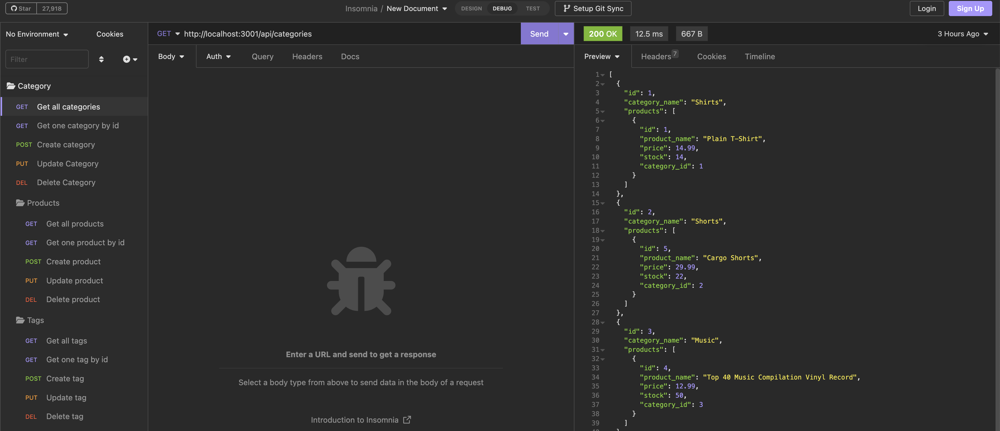
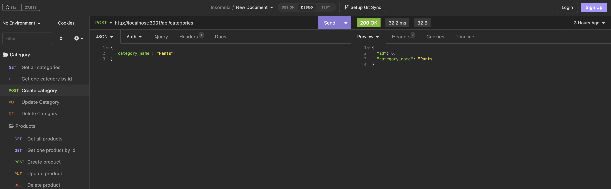

# My Shopper Backend


## Links

[Walkthrough Video](https://drive.google.com/file/d/1pPk3p78dewEXlqegHU1T5IhvrfWoZ0OO/view)

## Table of Contents

* [Description](#description)
* [Installation](#installation)
* [Code Example](#code-example)
* [Application Examples](#application-examples)
* [Usage](#usage)
* [License](#license)
* [Questions](#questions)


## Description
This is a backend application that allows for easy tracking of your e-commerce site. Use this applications to run request to either view all inventory, or an individual item with an associated id. Additionally this application can also be used to create new items as well as delete no longer wanted items from the e-commerce site.

## Installation
This a backend application would require forking to use. Simply fork the application to your local machine and start using an application like Insomnia to run GET, Put, Post, and Delete request.

## Code Example
Below is an example of code working to filter out an item by its provided id
```JS
// finds a single product by its 'id'
// and returns a status response
router.get('/:id', async (req, res) => {
  try {
    const { id } = req.params;
    const getOneProduct = await Product.findByPk(id, {
      include: [{ model: Category }, { model: Tag }]
    });

    if (!getOneProduct) {
      res.status(404).json({ message: `No product with id${id} found` });
      return;
    }
    res.status(200).json(getOneProduct);
  } catch (err) {
    res.status(400).json(err)
  }
});
```

## Application Examples
Bellow are a couple examples of the application when in use

The first example shows all categories with a GET request.


---

This second screenshot is an example of POST request that creates a category.



## Usage
Make sure you have followed the instructions within the [Installation](#installation) section of the README to start using this application, if not already done so. The use of the command line interface is required to first use this application. To get started first run the database by running the schema with mySQL, second use npm run seed to seed the database, and lastly run npm start to initiate the localhost to test. After the build, use an application like Insomnia to test your e-commerce site to pull the requested information, or pull individual items. This can also be used to test out adding additional items or deleting no longer needed items.


## License
For additional information on this license please use the provided link


[MIT License](https://choosealicense.com/licenses/mit/)

## Questions
Please refer any questions to my Github

Github: [jonnyboy808](https://github.com/jonnyboy808)


